# Android界面布局实验报告

## 一、 实验目的
通过实现四种不同的Android布局方式，深入理解ConstraintLayout、LinearLayout和TableLayout的特点、适用场景及实现效果。

## 二、 实验任务
1、用线性布局LinearLayout来设计UI

2、用表格布局TableLayout来设计UI

3、用约束布局ConstraintLayout来设计UI

## 三、 实验环境
Android Studio

SDK : API 24

Java语言

PC一台

## 四、 实验步骤与实验结果
### 1、设计主界面，其包含跳转至线性布局界面、表格布局界面、约束布局界面的用户交互按钮，按钮呈竖直方向线性排列。

**核心代码**

```java
 private void setupVerticalButtonLayout() {
        // 获取主布局
        LinearLayout mainLayout = findViewById(R.id.main);

        // 设置线性布局为垂直方向
        mainLayout.setOrientation(LinearLayout.VERTICAL);
        mainLayout.setGravity(Gravity.CENTER);

        // 创建跳转到线性布局的按钮
        Button linearLayoutButton = createButton("线性布局", LinearLayoutActivity.class);

        // 创建跳转到表格布局的按钮
        Button tableLayoutButton = createButton("表格布局", TableLayoutActivity.class);

        // 创建跳转到约束布局1的按钮
        Button constraintLayout1Button = createButton("约束布局1", ConstraintLayout1Activity.class);

        // 创建跳转到约束布局2的按钮
        Button constraintLayout2Button = createButton("约束布局2", ConstraintLayout2Activity.class);

        // 设置按钮的布局参数（外边距）
        LinearLayout.LayoutParams params = new LinearLayout.LayoutParams(
                LinearLayout.LayoutParams.MATCH_PARENT,
                LinearLayout.LayoutParams.WRAP_CONTENT
        );
        params.setMargins(50, 30, 50, 30);

        // 将按钮添加到布局中
        mainLayout.addView(linearLayoutButton, params);
        mainLayout.addView(tableLayoutButton, params);
        mainLayout.addView(constraintLayout1Button, params);
        mainLayout.addView(constraintLayout2Button, params);
    }

    private Button createButton(String text, final Class<?> targetActivity) {
        Button button = new Button(this);
        button.setText(text);
        button.setTextSize(18);
        button.setPadding(20, 20, 20, 20);
        button.setOnClickListener(new View.OnClickListener() {
            @Override
            public void onClick(View v) {
                Intent intent = new Intent(MainActivity.this, targetActivity);
                startActivity(intent);
            }
        });
        return button;
    }
```

**界面效果**

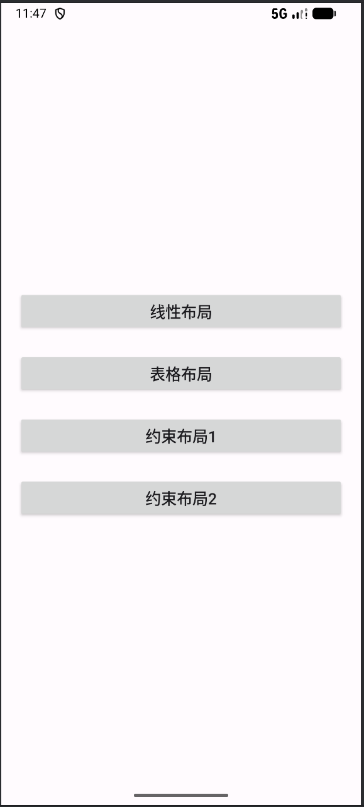


### 2、线性布局
**布局特点:**

 - 纯LinearLayout嵌套实现网格效果

 - 使用权重实现等分布局

 - 简单的文本视图排列

 **布局结构**

```
 LinearLayout (垂直方向，根布局)
├── LinearLayout (第一行，水平方向)
│   ├── TextView (1,1)
│   ├── TextView (1,2)
│   ├── TextView (1,3)
│   └── TextView (1,4)
├── ... (第二、三、四行类似结构)
```

**核心代码**

```xml
<LinearLayout xmlns:android="http://schemas.android.com/apk/res/android"
    android:layout_width="match_parent"
    android:layout_height="match_parent"
    android:orientation="vertical"
    android:background="@color/white"
    android:padding="16dp"
    android:id="@+id/linear_layout"
    >
<!--  第一行  -->
    <LinearLayout
        android:layout_width="match_parent"
        android:layout_height="0dp"
        android:layout_weight="1"
        android:orientation="horizontal"
        >
        <TextView
            android:layout_width="0dp"
            android:layout_height="match_parent"
            android:layout_weight="1"
            android:background="@color/black"
            android:textColor="@color/white"
            android:textSize="16sp"
            android:text="One,One"
            android:gravity="center"
            android:layout_margin="4dp"
            />
        <TextView
            android:layout_width="0dp"
            android:layout_height="match_parent"
            android:layout_weight="1"
            android:background="@color/black"
            android:textColor="@color/white"
            android:textSize="16sp"
            android:text="One,Two"
            android:gravity="center"
            android:layout_margin="4dp"
            />
        <TextView
            android:layout_width="0dp"
            android:layout_height="match_parent"
            android:layout_weight="1"
            android:background="@color/black"
            android:textColor="@color/white"
            android:textSize="16sp"
            android:text="One,Three"
            android:gravity="center"
            android:layout_margin="4dp"
            />
        <TextView
            android:layout_width="0dp"
            android:layout_height="match_parent"
            android:layout_weight="1"
            android:background="@color/black"
            android:textColor="@color/white"
            android:textSize="16sp"
            android:text="One,Four"
            android:gravity="center"
            android:layout_margin="4dp"
            />
    </LinearLayout>
    <!--第二、三、四行类似结构-->
```

**界面效果**

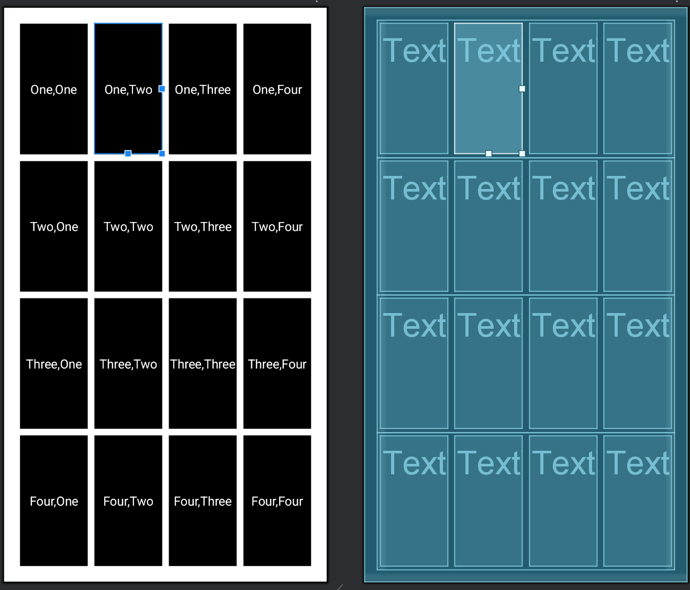

**业务功能代码**

```java
package com.hft.experiment2;

import android.os.Bundle;
import androidx.appcompat.app.AppCompatActivity;

public class LinearLayoutActivity extends AppCompatActivity {

    @Override
    protected void onCreate(Bundle savedInstanceState) {
        super.onCreate(savedInstanceState);
        setContentView(R.layout.linear_layout);


    }
}
```

**呈现效果**

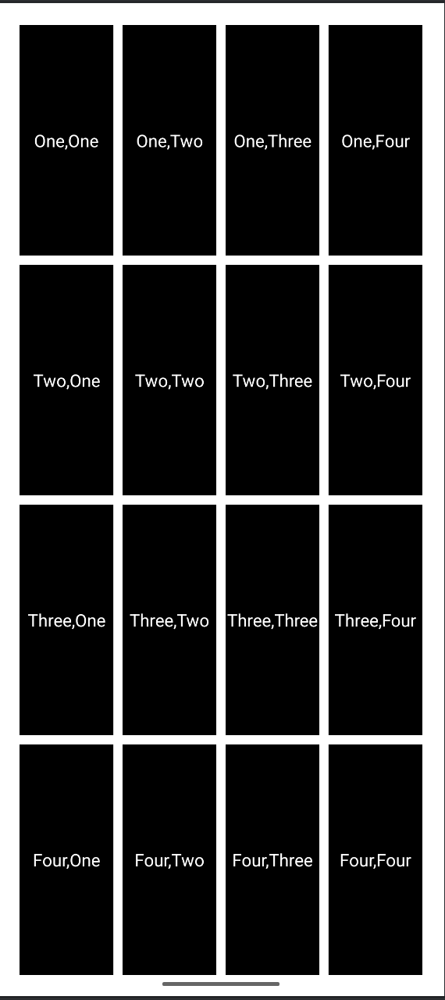

### 3、表格布局
**布局特点:**

 - 使用TableLayout实现表格形式布局

 - 菜单项与快捷键的对应显示

 - 分割线区分功能区域

 **布局结构**

```
LinearLayout (根布局)
    android:id="@+id/table_layout"
    android:orientation="vertical"
    android:padding="16dp"
    android:background="@color/dark_grey"
    |
    └── TableLayout
        android:background="@color/dark_grey"
        |
        ├── TextView (标题栏)
        │   android:text="@string/hello_table_layout"
        │   android:textStyle="bold"
        │
        ├── TableRow (第一行)
        │   android:padding="12dp"
        │   android:background="@color/light_grey"
        │   |
        │   ├── TextView (文本: "Open...")
        │   │   android:layout_weight="1"
        │   │
        │   └── TextView (文本: "Ctrl-O")
        │       android:layout_weight="1"
        │       android:gravity="end"
        │
        ├── TableRow (第二行)
        │   android:padding="12dp"
        │   android:background="@color/light_grey"
        │   |
        │   ├── TextView (文本: "Save...")
        │   │   android:layout_weight="1"
        │   │
        │   └── TextView (文本: "Ctrl-S")
        │       android:layout_weight="1"
        │       android:gravity="end"
        │
        ├── TableRow (第三行)
        │   android:padding="12dp"
        │   android:background="@color/light_grey"
        │   |
        │   ├── TextView (文本: "Save As...")
        │   │   android:layout_weight="1"
        │   │
        │   └── TextView (文本: "Ctrl-Shift-S")
        │       android:layout_weight="1"
        │       android:gravity="end"
        │
        ├── View (分割线)
        │   android:height="3dp"
        │   android:background="@color/white"
        │
        ├── TableRow (第四行)
        │   android:padding="12dp"
        │   android:background="@color/light_grey"
        │   |
        │   └── TextView (文本: "X Import...")
        │       android:layout_width="match_parent"
        │
        ├── TableRow (第五行)
        │   android:padding="12dp"
        │   android:background="@color/light_grey"
        │   |
        │   ├── TextView (文本: "X Export...")
        │   │   android:layout_weight="1"
        │   │
        │   └── TextView (文本: "Ctrl-E")
        │       android:layout_weight="1"
        │       android:gravity="end"
        │
        ├── View (分割线)
        │   android:height="3dp"
        │   android:background="@color/white"
        │
        └── TableRow (第六行)
            android:padding="12dp"
            android:background="@color/light_grey"
            |
            └── TextView (文本: "Quit")
                android:layout_width="match_parent"
```

**核心代码**

```xml
<TableLayout
        android:layout_width="match_parent"
        android:layout_height="match_parent"
        android:background="@color/dark_grey"
        >

        <TextView
            android:layout_width="match_parent"
            android:layout_height="wrap_content"
            android:background="@color/black"
            android:padding="16dp"
            android:text="@string/hello_table_layout"
            android:textColor="@color/white"
            android:textSize="18sp"
            android:textStyle="bold" />

        <TableRow
            android:layout_width="match_parent"
            android:layout_height="wrap_content"
            android:background="@color/light_grey"
            android:padding="12dp">

            <TextView
                android:layout_width="0dp"
                android:layout_height="wrap_content"
                android:layout_weight="1"
                android:text="Open..."
                android:textColor="@color/white"
                android:textSize="16sp"
                />
            <TextView
                android:layout_width="0dp"
                android:layout_height="wrap_content"
                android:layout_weight="1"
                android:text="Ctrl-O"
                android:textColor="@color/white"
                android:textSize="16sp"
                android:gravity="end"
                />
        </TableRow>

        <!--    添加分割线    -->
        <View
            android:layout_width="match_parent"
            android:layout_height="3dp"
            android:background="@color/white"
            />
```

**界面效果**

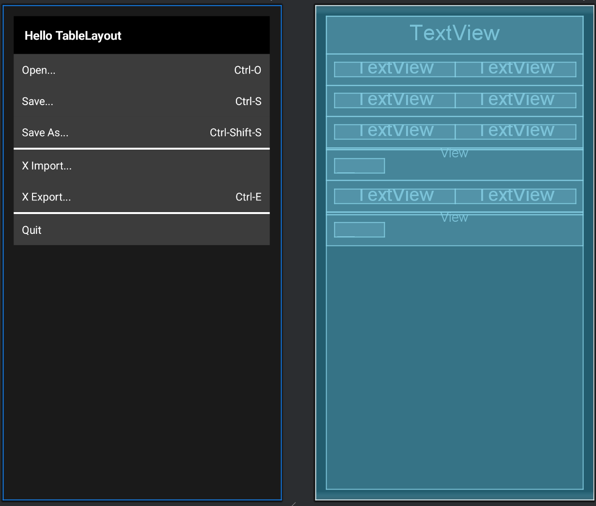

**业务功能代码**

```java
private void setupTableRowClicks() {
        // 获取最外层LinearLayout，再获取其中的TableLayout
        View rootLayout = findViewById(R.id.table_layout);
        if (!(rootLayout instanceof android.widget.LinearLayout)) return;

        android.widget.LinearLayout linearLayout = (android.widget.LinearLayout) rootLayout;
        if (linearLayout.getChildCount() == 0) return;

        // 获取TableLayout
        View child = linearLayout.getChildAt(0);
        if (!(child instanceof TableLayout)) return;

        TableLayout tableLayout = (TableLayout) child;

        // 通过遍历TableLayout中的所有子视图动态绑定事件（跳过非TableRow）
        for (int i = 0; i < tableLayout.getChildCount(); i++) {
            View rowView = tableLayout.getChildAt(i);

            if (rowView instanceof TableRow) {
                TableRow row = (TableRow) rowView;

                // 获取第一列文字（菜单名）
                String menuText = "";
                if (row.getChildCount() > 0 && row.getChildAt(0) instanceof TextView) {
                    menuText = ((TextView) row.getChildAt(0)).getText().toString();
                }

                final String finalMenuText = menuText;

                // 为整行设置点击监听
                row.setOnClickListener(v -> handleMenuClick(finalMenuText));

                // 为每个TextView也设置点击监听（方便独立点击）
                for (int j = 0; j < row.getChildCount(); j++) {
                    View cell = row.getChildAt(j);
                    if (cell instanceof TextView) {
                        cell.setOnClickListener(v -> handleMenuClick(finalMenuText));
                        cell.setClickable(true);
                        cell.setFocusable(true);
                    }
                }

                // 添加按下效果（点击反馈）
                row.setClickable(true);
                row.setFocusable(true);
                row.setBackgroundResource(android.R.drawable.list_selector_background);
            }
        }
    }

    private void handleMenuClick(String menuText) {
        switch (menuText) {
            case "Open...":
                openFile();
                break;
            case "Save...":
                saveFile();
                break;
            case "Save As...":
                saveAsFile();
                break;
            case "X Import...":
                importFile();
                break;
            case "X Export...":
                exportFile();
                break;
            case "Quit":
                quitApplication();
                break;
            default:
                showToast("点击了：" + menuText);
                break;
        }
    }

    private void openFile() {
        showToast("打开文件对话框");
    }

    private void saveFile() {
        showToast("保存当前文件");
    }

    private void saveAsFile() {
        showToast("文件另存为");
    }

    private void importFile() {
        showToast("导入文件");
    }

    private void exportFile() {
        showToast("导出文件");
    }

    private void quitApplication() {
        showToast("退出应用");
        finish();
    }

    private void showToast(String message) {
        Toast.makeText(this, message, Toast.LENGTH_SHORT).show();
    }

```

**代码解读**

上面的代码为每个菜单行（TableRow）及其内部的文本（TextView）绑定点击事件。​根据点击的菜单项执行不同操作的消息提示（如打开文件、保存、退出等）。特别是点击Quit时，应用会先退出，再提示退出应用。

**呈现效果**

这里简单列举两个。

(1)点击Open...行

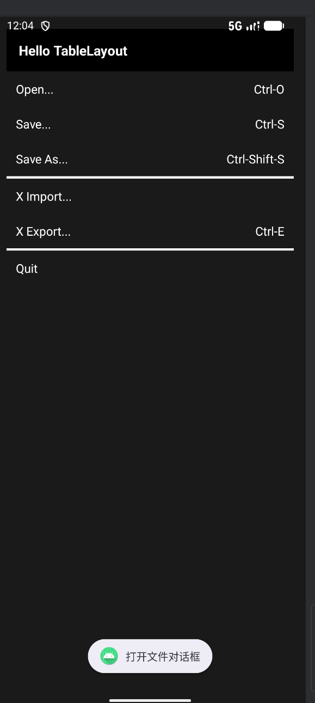

(2)点击Quit行

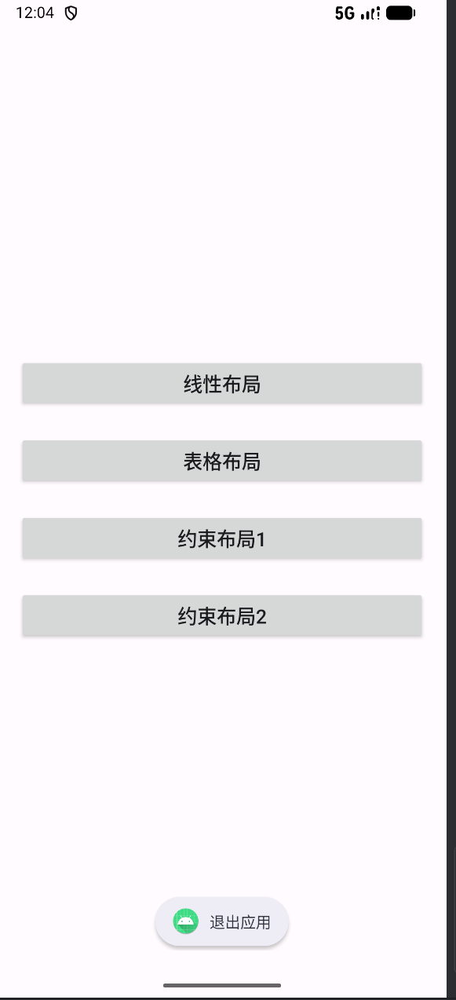


### 4、约束布局1
**布局特点:**

 - 使用ConstraintLayout作为根布局，实现复杂的约束关系

 - 采用CardView包装按钮，提升视觉效果

 - 通过权重分配实现按钮的等比例分布

 **布局结构**

```
 ConstraintLayout (根布局)
├── TextView (标题)
├── CardView (输入输出区域)
│   └── LinearLayout
│       ├── TextView (输入提示)
│       └── TextView (数值显示)
└── ConstraintLayout (按钮容器)
    └── 16个CardView按钮 (4×4网格)
```

**核心代码**

```xml
<androidx.cardview.widget.CardView
        android:id="@+id/input_output"
        android:layout_width="0dp"
        android:layout_height="120dp"
        android:layout_marginTop="24dp"
        android:elevation="4dp"
        app:cardBackgroundColor="@color/light_grey"
        app:cardCornerRadius="12dp"
        app:layout_constraintStart_toStartOf="parent"
        app:layout_constraintEnd_toEndOf="parent"
        app:layout_constraintTop_toBottomOf="@id/title"
        >
        <LinearLayout
            android:layout_width="match_parent"
            android:layout_height="match_parent"
            android:orientation="vertical"
            android:padding="16dp"
            >
            <TextView
                android:id="@+id/input_tip"
                android:layout_width="match_parent"
                android:layout_height="wrap_content"
                android:text="@string/input"
                android:textColor="@color/white"
                android:textStyle="bold"
                android:textSize="18sp"
                />
            <TextView
                android:id="@+id/value"
                android:layout_width="match_parent"
                android:layout_height="0dp"
                android:layout_weight="1"
                android:text="0.0"
                android:textColor="@color/white"
                android:textStyle="bold"
                android:textSize="30sp"
                android:gravity="end|center_vertical"
                />
        </LinearLayout>
    </androidx.cardview.widget.CardView>

    <!--按钮7为例，以下类似-->
    <!--    第一行        -->
        <androidx.cardview.widget.CardView
            android:id="@+id/bt7"
            android:layout_width="0dp"
            android:layout_height="0dp"
            android:layout_margin="8dp"
            app:cardBackgroundColor="@color/light_grey"
            app:cardCornerRadius="12dp"
            app:cardElevation="3dp"
            app:layout_constraintStart_toStartOf="parent"
            app:layout_constraintEnd_toStartOf="@id/bt8"
            app:layout_constraintTop_toTopOf="parent"
            app:layout_constraintBottom_toTopOf="@id/bt4"
            app:layout_constraintVertical_weight="1"
            app:layout_constraintHorizontal_weight="1"
            >
            <Button
                android:layout_width="match_parent"
                android:layout_height="match_parent"
                android:text="7"
                android:textColor="@color/white"
                android:textSize="20sp"
                android:textStyle="bold"
                android:gravity="center"
                android:background="@android:color/transparent"
                />
        </androidx.cardview.widget.CardView>
        
```

**界面效果**

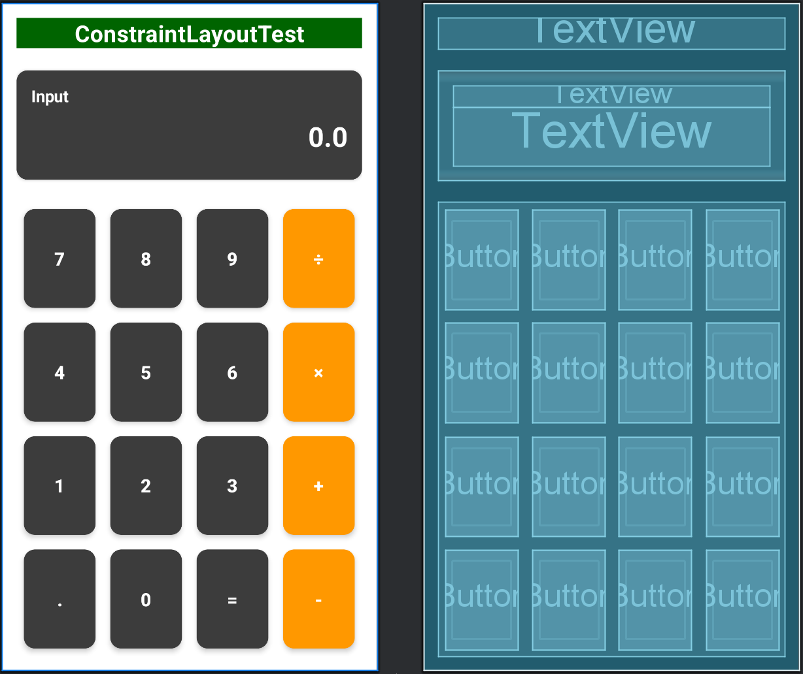


**业务功能代码**

```java
public class ConstraintLayout1Activity extends AppCompatActivity {

    private static final String TAG = "ConstraintLayout1Activity";

    private TextView valueDisplay;
    private String currentInput = "0";
    private double firstValue = 0;
    private String currentOperator = "";
    private boolean resetOnNextInput = false;

    private final DecimalFormat decimalFormat = new DecimalFormat("0.##########");

    @Override
    protected void onCreate(Bundle savedInstanceState) {
        super.onCreate(savedInstanceState);
        try {
            setContentView(R.layout.constraint_layout_1);
            initializeCalculator();
        } catch (Exception e) {
            Log.e(TAG, "初始化失败: " + e.getMessage(), e);
            Toast.makeText(this, "界面初始化失败: " + e.getMessage(), Toast.LENGTH_LONG).show();
            finish();
        }
    }

    private void initializeCalculator() {
        Log.d(TAG, "开始初始化计算器");

        valueDisplay = findViewById(R.id.value);
        if (valueDisplay == null) {
            throw new RuntimeException("找不到value TextView");
        }

        initializeNumberButtons();
        initializeOperatorButtons();
        initializeFunctionButtons();

        updateDisplay();
        Log.d(TAG, "计算器初始化完成");
    }

    private void initializeNumberButtons() {
        setupNumberButton(R.id.bt0, "0");
        setupNumberButton(R.id.bt1, "1");
        setupNumberButton(R.id.bt2, "2");
        setupNumberButton(R.id.bt3, "3");
        setupNumberButton(R.id.bt4, "4");
        setupNumberButton(R.id.bt5, "5");
        setupNumberButton(R.id.bt6, "6");
        setupNumberButton(R.id.bt7, "7");
        setupNumberButton(R.id.bt8, "8");
        setupNumberButton(R.id.bt9, "9");
        setupDecimalButton();
    }

    private void initializeOperatorButtons() {
        setupOperatorButton(R.id.bt_plus, "+");
        setupOperatorButton(R.id.bt_subtract, "-");
        setupOperatorButton(R.id.bt_multiply, "×");
        setupOperatorButton(R.id.bt_divide, "÷");
    }

    private void initializeFunctionButtons() {
        setupEqualsButton();
    }

    private void setupNumberButton(int cardViewId, final String number) {
        setupButton(cardViewId, v -> appendNumber(number));
    }

    private void setupOperatorButton(int cardViewId, final String operator) {
        setupButton(cardViewId, v -> setOperator(operator));
    }

    private void setupDecimalButton() {
        setupButton(R.id.bt_point, v -> {
            if (resetOnNextInput) {
                currentInput = "0";
                resetOnNextInput = false;
            }
            if (!currentInput.contains(".")) {
                // 如果是刚开始输入，直接变为 "0."
                if (currentInput.equals("0") || currentInput.equals("Error")) {
                    currentInput = "0.";
                } else {
                    currentInput += ".";
                }
                updateDisplay();
            }
        });
    }

    private void setupEqualsButton() {
        setupButton(R.id.bt_equal, v -> calculateResult());
    }

    private void setupButton(int cardViewId, View.OnClickListener listener) {
        try {
            CardView cardView = findViewById(cardViewId);
            if (cardView != null && cardView.getChildCount() > 0) {
                View child = cardView.getChildAt(0);
                if (child instanceof Button) {
                    ((Button) child).setOnClickListener(listener);
                }
            }
        } catch (Exception e) {
            Log.e(TAG, "设置按钮失败: " + e.getMessage());
        }
    }

    private void appendNumber(String number) {
        if (currentInput.equals("Error")) {
            // 从错误状态恢复
            currentInput = "0";
        }
        if (resetOnNextInput) {
            currentInput = "0";
            resetOnNextInput = false;
        }
        // 防止多余前导0
        if (currentInput.equals("0") && !number.equals(".")) {
            currentInput = number;
        } else {
            currentInput += number;
        }
        updateDisplay();
    }

    private void setOperator(String operator) {
        // 如果当前已存在运算符并且不是刚刚输入的运算符，则先计算结果
        if (!currentOperator.isEmpty() && !resetOnNextInput) {
            calculateResult();
        }
        try {
            firstValue = Double.parseDouble(currentInput);
            currentOperator = operator;
            resetOnNextInput = true;
        } catch (NumberFormatException e) {
            Toast.makeText(this, "数字格式错误", Toast.LENGTH_SHORT).show();
            currentInput = "0";
            updateDisplay();
        }
    }

    private void calculateResult() {
        if (currentOperator.isEmpty()) return;

        try {
            double secondValue = Double.parseDouble(currentInput);
            double result = 0;

            switch (currentOperator) {
                case "+": result = firstValue + secondValue; break;
                case "-": result = firstValue - secondValue; break;
                case "×": result = firstValue * secondValue; break;
                case "÷":
                    if (secondValue == 0) {
                        currentInput = "Error";
                        updateDisplay();
                        currentOperator = "";
                        return;
                    }
                    result = firstValue / secondValue;
                    break;
            }

            currentInput = decimalFormat.format(result);
            firstValue = result; // 支持连续计算
            currentOperator = "";
            resetOnNextInput = true;
            updateDisplay();

        } catch (Exception e) {
            Log.e(TAG, "计算错误: " + e.getMessage());
            currentInput = "Error";
            updateDisplay();
        }
    }

    private void updateDisplay() {
        if (valueDisplay != null) {
            valueDisplay.setText(currentInput);
        }
    }
}
```

**代码解读**

上面代码主要实现了计算器的基本功能(加、减、乘、除四则运算)，支持连续计算和小数运算，具有完善的错误处理机制和用户友好的界面交互。

**呈现效果**

(1)初始化界面

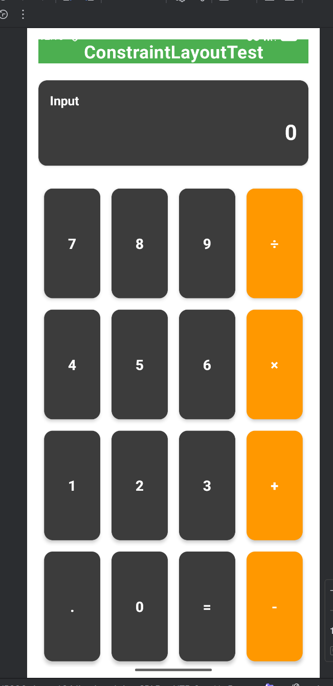

(2)举一个 9.9 ÷ 0.9 = 11的例子

输入9.9

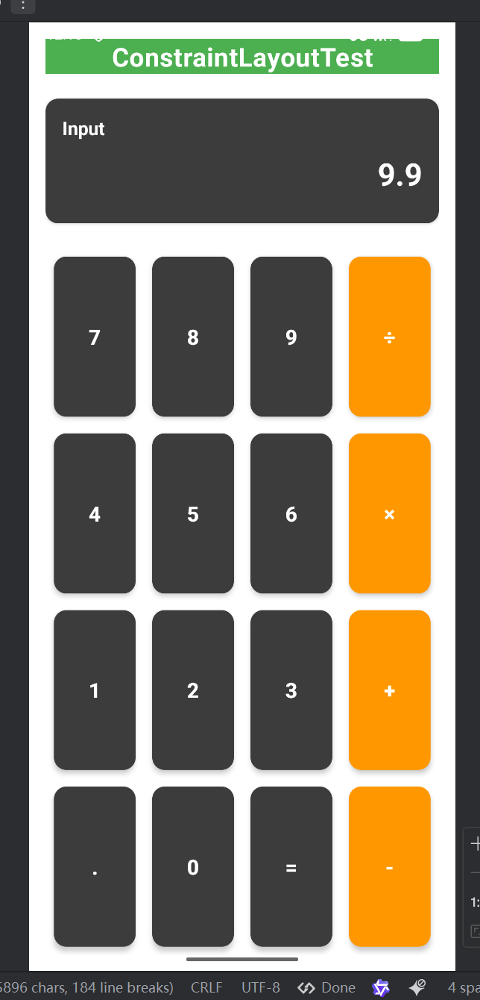

再输入 ÷ 和 0.9

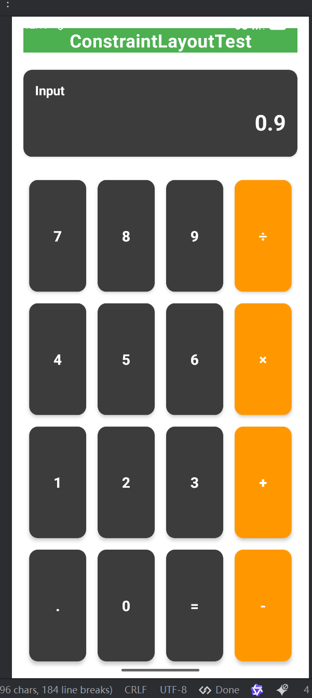

点击 = 得出最后结果

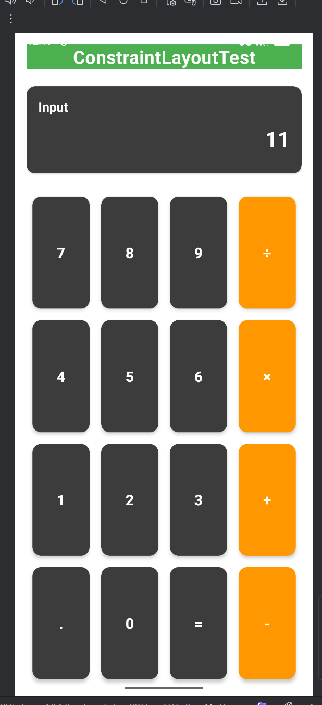

### 5、约束布局2
**布局特点:**

 - 复杂的多组件约束布局

 - 使用图片资源增强视觉效果

 - 多种交互组件（按钮、开关、图片视图）

 **布局结构**

```
 ConstraintLayout (根布局)
    android:id="@+id/constraint_layout_2"
    android:padding="14dp"
    android:background="@color/white"
    |
    ├── 顶部按钮行 (三个等宽按钮)
    │   ├── Button (id=bt_space_stations)
    │   │   android:layout_height="168dp"
    │   │   app:layout_constraintHorizontal_weight="1"
    │   │   约束: start_toStartOf parent, end_toStartOf bt_flights, top_toTopOf parent
    │   │
    │   ├── Button (id=bt_flights)
    │   │   android:layout_height="168dp"
    │   │   app:layout_constraintHorizontal_weight="1"
    │   │   约束: start_toEndOf bt_space_stations, end_toStartOf bt_rovers, top_toTopOf parent
    │   │
    │   └── Button (id=bt_rovers)
    │       android:layout_height="168dp"
    │       app:layout_constraintHorizontal_weight="1"
    │       约束: start_toEndOf bt_flights, end_toEndOf parent, top_toTopOf parent
    │
    ├── 中部按钮组 (DCA ↔ MARS)
    │   ├── Button (id=bt_DCA)
    │   │   android:layout_height="90dp"
    │   │   约束: start_toStartOf parent, end_toStartOf iv_double_arrows, top_toBottomOf bt_space_stations
    │   │
    │   ├── ImageView (id=iv_double_arrows)
    │   │   android:layout_width="60dp"
    │   │   android:layout_height="60dp"
    │   │   约束: start_toEndOf bt_DCA, end_toStartOf bt_MARS, top_toTopOf bt_DCA, bottom_toBottomOf bt_DCA
    │   │
    │   └── Button (id=bt_MARS)
    │       android:layout_height="90dp"
    │       约束: start_toEndOf iv_double_arrows, end_toEndOf parent, top_toBottomOf bt_rovers
    │
    ├── 左侧控制区域
    │   ├── Switch (id=switch_one_way)
    │   │   android:layout_height="40dp"
    │   │   约束: start_toStartOf parent, top_toBottomOf bt_DCA
    │   │
    │   └── Button (id=bt_traveller)
    │       android:layout_height="40dp"
    │       约束: start_toStartOf parent, top_toBottomOf switch_one_way
    │
    ├── 图像区域
    │   ├── ImageView (id=iv_galaxy_rocket)
    │   │   android:layout_width="26dp"
    │   │   android:layout_height="79dp"
    │   │   约束: start_toStartOf parent, end_toStartOf iv_galaxy, top_toBottomOf bt_traveller, bottom_toTopOf bt_depart
    │   │
    │   └── ImageView (id=iv_galaxy)
    │       android:layout_width="0dp" (自适应约束)
    │       android:layout_height="0dp" (自适应约束)
    │       约束: start_toEndOf iv_galaxy_rocket, end_toEndOf parent, top_toBottomOf bt_traveller, bottom_toTopOf bt_depart
    │
    └── 底部按钮
        └── Button (id=bt_depart)
            android:layout_height="58dp"
            约束: start_toStartOf parent, end_toEndOf parent, top_toBottomOf iv_galaxy, bottom_toBottomOf parent
```

**核心代码**

```xml
<!-- 按钮 -->
<Button
        android:id="@+id/bt_space_stations"
        android:layout_width="0dp"
        app:layout_constraintHorizontal_weight="1"
        android:layout_height="168dp"
        android:background="@color/construction_grey"
        android:drawableTop="@drawable/space_station_icon"
        android:drawablePadding="4dp"
        android:text="@string/space_stations"
        android:textColor="@color/black"
        android:textSize="15sp"
        android:gravity="center"
        app:layout_constraintStart_toStartOf="parent"
        app:layout_constraintEnd_toStartOf="@id/bt_flights"
        app:layout_constraintTop_toTopOf="parent"
        />

        <Button
        android:id="@+id/bt_DCA"
        android:layout_width="0dp"
        android:layout_height="90dp"
        android:layout_marginStart="30dp"
        android:layout_marginTop="25dp"
        android:background="@color/success_green"
        android:gravity="center"
        android:text="@string/dca"
        android:textColor="@color/white"
        android:textSize="25sp"
        app:layout_constraintEnd_toStartOf="@id/iv_double_arrows"
        app:layout_constraintStart_toStartOf="parent"
        app:layout_constraintTop_toBottomOf="@id/bt_space_stations" />
    <!-- 图片 -->
    <ImageView
        android:id="@+id/iv_double_arrows"
        android:layout_width="60dp"
        android:layout_height="60dp"
        android:src="@drawable/double_arrows"
        app:layout_constraintStart_toEndOf="@id/bt_DCA"
        app:layout_constraintEnd_toStartOf="@id/bt_MARS"
        app:layout_constraintTop_toTopOf="@id/bt_DCA"
        app:layout_constraintBottom_toBottomOf="@id/bt_DCA"

        />
        <!--开关-->
        <Switch
        android:id="@+id/switch_one_way"
        android:layout_width="wrap_content"
        android:layout_height="40dp"
        android:background="@color/orange"
        android:layout_marginTop="20dp"
        android:layout_marginStart="10dp"
        android:text="@string/one_way"
        android:textColor="@color/white"
        android:textSize="15sp"
        app:layout_constraintStart_toStartOf="parent"
        app:layout_constraintTop_toBottomOf="@id/bt_DCA"
        />
```
**界面效果**

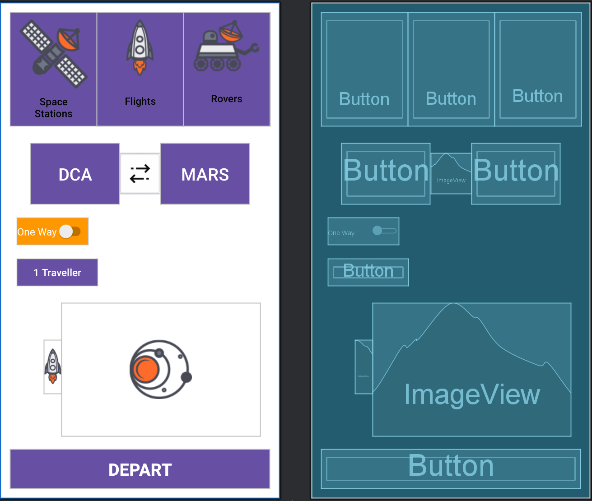

**业务功能代码**

```java
public class ConstraintLayout2Activity extends AppCompatActivity {

    private Switch oneWaySwitch;
    private Button travellerButton;
    private Button departButton;

    @Override
    protected void onCreate(Bundle savedInstanceState) {
        super.onCreate(savedInstanceState);
        setContentView(R.layout.constraint_layout_2);

        initializeComponents();
        setupEventListeners();
    }

    private void initializeComponents() {
        oneWaySwitch = findViewById(R.id.switch_one_way);
        travellerButton = findViewById(R.id.bt_traveller);
        departButton = findViewById(R.id.bt_depart);

        // 设置其他功能按钮
        setupSpaceStationButton();
        setupFlightsButton();
        setupRoversButton();
        setupDCAButton();
        setupMarsButton();
    }

    private void setupEventListeners() {
        // 单程/往返开关
        if (oneWaySwitch != null) {
            oneWaySwitch.setOnCheckedChangeListener((buttonView, isChecked) -> {
                String message = isChecked ? "单程旅行已选择" : "往返旅行已选择";
                Toast.makeText(this, message, Toast.LENGTH_SHORT).show();
            });
        }

        // 旅客信息按钮
        if (travellerButton != null) {
            travellerButton.setOnClickListener(new View.OnClickListener() {
                @Override
                public void onClick(View v) {
                    showTravellerInfo();
                }
            });
        }

        // 出发按钮
        if (departButton != null) {
            departButton.setOnClickListener(new View.OnClickListener() {
                @Override
                public void onClick(View v) {
                    startJourney();
                }
            });
        }
    }

    private void setupSpaceStationButton() {
        Button spaceStationButton = findViewById(R.id.bt_space_stations);
        if (spaceStationButton != null) {
            spaceStationButton.setOnClickListener(v ->
                    Toast.makeText(this, "查看空间站信息", Toast.LENGTH_SHORT).show());
        }
    }

    private void setupFlightsButton() {
        Button flightsButton = findViewById(R.id.bt_flights);
        if (flightsButton != null) {
            flightsButton.setOnClickListener(v ->
                    Toast.makeText(this, "查看航班信息", Toast.LENGTH_SHORT).show());
        }
    }

    private void setupRoversButton() {
        Button roversButton = findViewById(R.id.bt_rovers);
        if (roversButton != null) {
            roversButton.setOnClickListener(v ->
                    Toast.makeText(this, "查看漫游车信息", Toast.LENGTH_SHORT).show());
        }
    }

    private void setupDCAButton() {
        Button dcaButton = findViewById(R.id.bt_DCA);
        if (dcaButton != null) {
            dcaButton.setOnClickListener(v ->
                    Toast.makeText(this, "选择DCA作为出发地", Toast.LENGTH_SHORT).show());
        }
    }

    private void setupMarsButton() {
        Button marsButton = findViewById(R.id.bt_MARS);
        if (marsButton != null) {
            marsButton.setOnClickListener(v ->
                    Toast.makeText(this, "选择火星作为目的地", Toast.LENGTH_SHORT).show());
        }
    }

    private void showTravellerInfo() {
        // 这里可以跳转到旅客信息页面或显示对话框
        Toast.makeText(this, "编辑旅客信息", Toast.LENGTH_SHORT).show();
    }

    private void startJourney() {
        boolean isOneWay = oneWaySwitch != null && oneWaySwitch.isChecked();
        String journeyType = isOneWay ? "单程" : "往返";

        String message = "开始" + journeyType + "太空旅行！准备发射！";
        Toast.makeText(this, message, Toast.LENGTH_LONG).show();


    }
}
```

**代码解读**

上面代码实现了一个完整的太空旅行预订流程界面原型，通过Toast消息模拟了各功能点的交互反馈，用户可以点击界面中的按钮与开关进行交互活动。

**呈现效果**

(1)点击开关

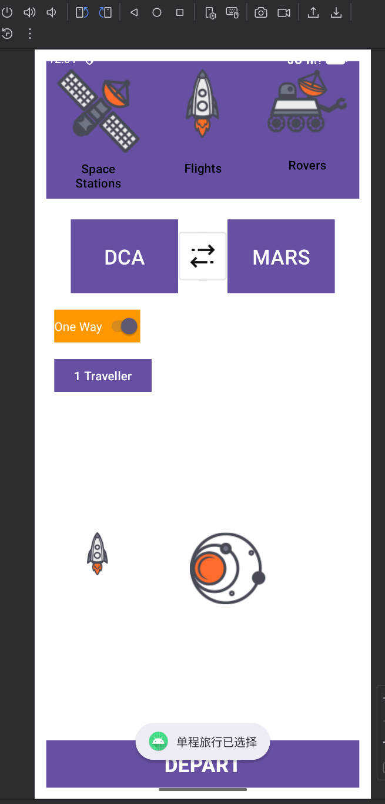

(2)点击按钮

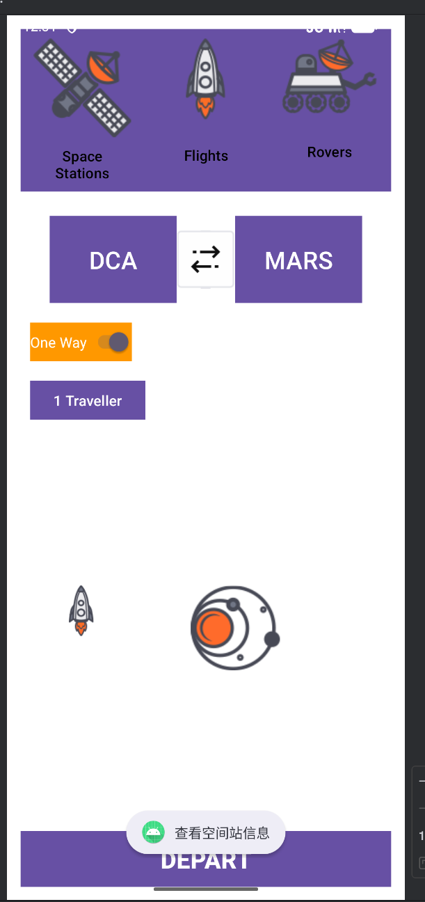

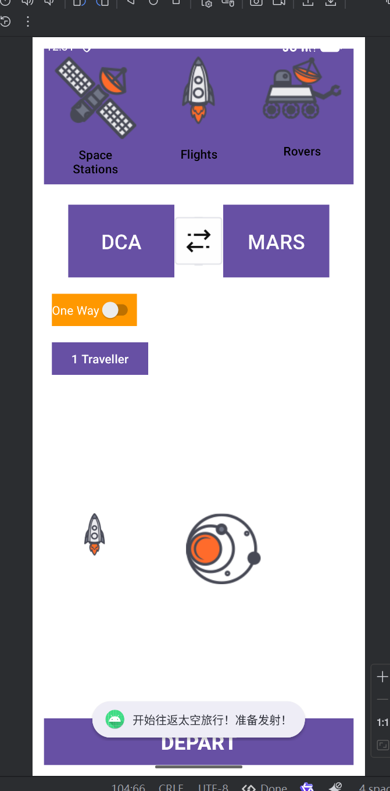


## 五、 总结与探讨
1、布局技术对比

|布局方式|适用场景|优点|缺点
|-----------------|-------------------|---------------|-----------|
|ConstraintLayout|复杂界面、需要精确控制|灵活性高、性能好|学习曲线较陡|
|LinearLayout|简单线性排列|简单易用、代码清晰|嵌套过多影响性能|
|TableLayout|表格形式数据|表格显示整齐|灵活性较差|

2、遇到的问题及解决方案

(1)​约束冲突​​：在ConstraintLayout中需注意约束关系的合理性
​​

(2)权重分配​​：LinearLayout中权重需要正确设置宽高为0dp
​​

(3)屏幕适配​​：使用dp、sp单位确保不同屏幕尺寸的适配性

3、收获与总结

通过本次Android界面布局实验，我深入理解了不同布局方式的特点和适用场景。ConstraintLayout作为现代Android开发的首选布局，在复杂界面中展现出强大的灵活性；LinearLayout在简单线性排列时具有代码简洁的优势；TableLayout则为表格状数据展示提供了天然支持。

实验中遇到的主要挑战是ConstraintLayout的约束关系管理和多屏幕适配问题，通过查阅文档和实践探索，我逐步掌握了解决方法。这次实验不仅提升了我的技术水平，也培养了我解决实际问题的能力。

在未来的开发中，我将根据具体需求合理选择布局方式，注重界面性能和用户体验，不断提升自己的开发能力。

4、遇到的问题

点击按钮，页面并没有跳转至按钮相应的页面。

解决方案：

查看AndroidManifest.xml文件，添加相应界面类的activity标签，确保要跳转至的界面的Activity都已注册。